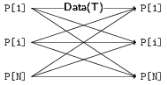
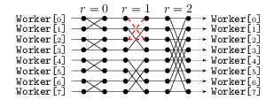
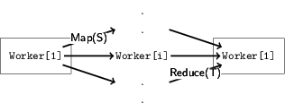
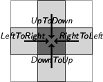

Use case: Network Topologies
============================

This is a use case based on the published work
**Protocols by Default: Safe MPI Code Generation based on Session Types**
(doi:[10.1007/978-3-662-46663-6_11](http://dx.doi.org/10.1007/978-3-662-46663-6_11)
where Pabble (Parameterised Scribble) protocols are used to represent
communication patterns in parallel computing and generate MPI code.

### Common communication patterns in this use case:

 * All-to-All (Alltoall)

   
 * Master-Worker (Farm)
 * 64-process FFT (FFT64)

   
 * Ring

   
 * Scatter-Gather

   
 * Stencil

   

### Implementations

The [implementations](Implementation) are the MPI backbone code
generated from the respective Pabble protocols.
